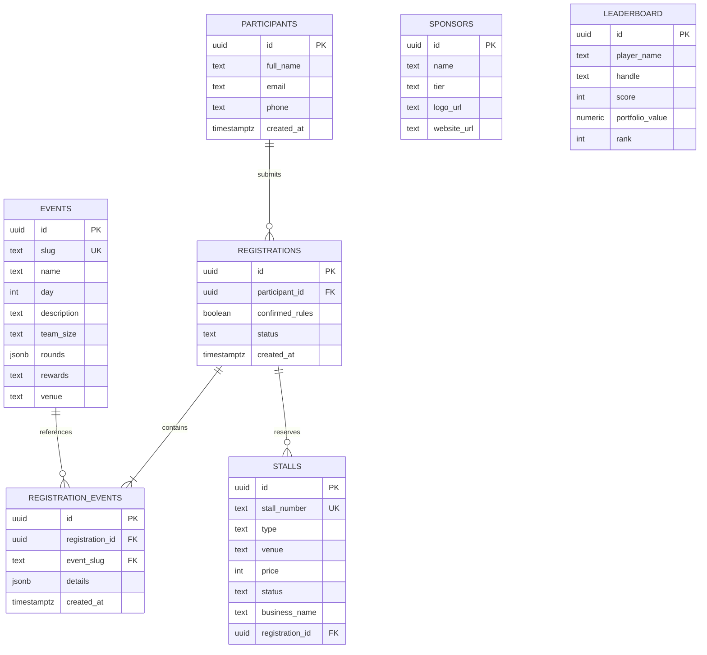

# 🏆 Cabinet Valley

> **Official Event Platform & Management System for Cabinet Valley** — A 3-day flagship university fest organized by the Student Cabinet. Built as a high-performance Next.js monolith with Supabase, dynamic multi-event registration, interactive stall allocation, live trading leaderboards, and an authenticated administrative command center.

---

## ⚡ Overview

**Cabinet Valley** is an annual 3-day university entrepreneurship, business, and tech festival featuring 6 flagship competitions, 50+ marketplace stalls, founder 1-on-1s, and a massive prize pool.

This repository contains the complete full-stack web application powering the event:
- **Public Event Portal (`/`)**: High-impact, typography-first landing experience featuring an interactive horizontal event carousel, bento-grid timeline, live countdown tickers, and dynamic leaderboard simulations.
- **Dynamic Registration Engine (`/register`)**: Context-aware, multi-select registration form with conditional validation schema powered by Zod and React Hook Form.
- **Admin Management Console (`/admin`)**: Auth-gated dashboard for live telemetry, participant submission filtering, CSV data export, and interactive visual stall floorplan management.

---

## 🎨 Design Philosophy

Cabinet Valley departs from generic corporate layouts and glossy glassmorphic trends in favor of a **bold, high-contrast, neo-brutalist "Awards Show" aesthetic**:

- **Display Typography:** Massive, tight-leading condensed grotesk headline treatments (*Anton / Archivo Black*) with ghosted parallax repeat lines.
- **High Contrast Palette:** Ultra-clean `#FFFFFF` and deep `#0A0A0A` ink foundation punctuated by electric primary violet (`#7C3AED`) and vibrant lime accents (`#C6F135`).
- **Tactile UI Elements:** Crisp hard-edged cards with intentional border radiuses, flat solid color pill tags, smooth Lenis scrolling, and orchestrated Framer Motion transitions.

```
┌────────────────────────────────────────────────────────────────────────┐
│  COLOR TOKENS                                                          │
│  Base Background  : #FFFFFF   (Pure White)                             │
│  Ink / Contrast   : #0A0A0A   (Deep Obsidian / Black Band)             │
│  Primary Accent   : #7C3AED   (Electric Violet - CTAs & Highlights)    │
│  Secondary Accent : #C6F135   (Volt Lime - Tickers & Numbers)          │
│  Tag Color Alpha  : #FF5A36   (Warm Vermillion - Event Badges)         │
│  Tag Color Beta   : #2F6FED   (Cobalt Blue - Event Badges)             │
└────────────────────────────────────────────────────────────────────────┘
```

---

## 🚀 Key Features

### 1. Public Experience (`/`)
- **Hero Display:** Giant stacked condensed typography, quick stats card, live countdown ticker targeting fest kickoff, and instant registration triggers.
- **Impact Stats Band:** Full-width dark stats bar highlighting 3 Days, 6 Flagship Events, 50+ Stalls, and ₹1.5L+ in rewards.
- **Interactive Events Carousel:** Fluid horizontal carousel showcasing all 6 competitions with categorized rounds, prize details, team sizes, and venues.
- **Bento-Grid Timeline ("The Road to Cabinet Valley"):** Day-by-day interactive schedule matrix organizing the 3-day fest timeline.
- **Live Leaderboard:** Simulated real-time scoring ticker for the *Bulls & Bears* financial trading challenge.
- **Sponsors & Rewards Showcase:** Tiered sponsor marquee (Title, Platinum, Gold) and rewards breakdown (internships, certificates, trophies).
- **Responsive Navigation & Footer:** Sticky navigation header with mobile menu and full-bleed action footer.

### 2. Smart Multi-Event Registration Engine (`/register`)
- **Multi-Select Event Enrollment:** Participants can register for single or multiple events in a unified submission.
- **Dynamic Conditional Schema:** The form dynamically injects and validates specialized fieldsets according to selected events:
  - **Startup Roulette:** Team name, leader, member roster (up to 5), idea name & startup description.
  - **The War Room:** 5-member team roster, team name, and leader details.
  - **The Boardroom:** Duo partner details and executive case presentation profile.
  - **Entre-Prenormie:** Custom founder dialogue prompt / discussion topic.
  - **Bay Area:** Business name, contact person, and phone number for German Hangar commercial stall booking.
  - **Bulls & Bears:** Individual trading seat confirmation.
- **Celebration Feedback:** Full particle confetti burst on successful submission and downloadable confirmation summary.

### 3. Internal Admin Console (`/admin`)
- **Authentication:** Backed by Supabase Auth with an automated fallback dev mode for local testing.
- **Analytics Dashboard:** Live metrics on total registrations, per-event breakdown, stall occupancy rate, and estimated stall revenue.
- **Submissions Management:** Searchable, event-filterable participant table with details inspection modal and one-click CSV export.
- **Bay Area Stall Manager:** Visual floorplan grid managing 50 Main Stalls (German Hangar @ ₹4,000), supporting status updates (*Available*, *Pending*, *Allocated*, *Paid*).
- **System Settings:** Control countdown datetime targets and site status flags.

---

## 📅 Flagship Events Schedule

| Day | Event | Format & Size | Highlights & Rewards |
|---|---|---|---|
| **Day 1** | **Startup Roulette** | 5 members (12 teams max) | 3-round pivot challenge: *Home Pitch*, *Steal the Startup*, *Sell the Scam*. Top 3 win certificates + 3-month Founder's Office Internship. |
| **Day 1 & 2** | **Bay Area Stalls** | Individual / Startup Teams | 50 Main Stalls (German Hangar @ ₹4,000). Marketplace & startup showcase. |
| **Day 2** | **The War Room** | 5 members | High-stakes blind asset bidding & rapid crisis pitching under judge scrutiny. |
| **Day 2** | **The Boardroom** | 2 members (Duos) | Corporate dilemma case study resolution and turnaround roadmap presentation. |
| **Day 3** | **Entre-Prenormie** | Individual (1-on-1) | Exclusive 1-on-1 mentorship deep dives with verified startup founders. |
| **Day 3** | **Bulls & Bears** | Individual | Rapid financial market quiz and simulated portfolio sprint with live leaderboard. |
| **Day 3** | **Rewarding Ceremony** | All Participants | Grand finale awarding trophies, certificates, and internship offers. |

---

## 🛠️ Tech Stack

- **Framework:** [Next.js 15](https://nextjs.org/) (App Router, Server & Client Components)
- **Language:** [TypeScript](https://www.typescriptlang.org/)
- **Styling:** [Tailwind CSS](https://tailwindcss.com/) + PostCSS + custom utility extensions
- **UI Components:** [shadcn/ui](https://ui.shadcn.com/) + [HeroUI](https://heroui.com/) patterns + [Lucide React](https://lucide.dev/)
- **Animations & Smooth Scroll:** [Motion for React](https://motion.dev/) + [Lenis](https://lenis.darkroom.engineering/) + [Canvas Confetti](https://www.npmjs.com/package/canvas-confetti)
- **Forms & Validation:** [React Hook Form](https://react-hook-form.com/) + [Zod](https://zod.dev/) + `@hookform/resolvers`
- **Database & Auth:** [Supabase](https://supabase.com/) (PostgreSQL, Row Level Security, Auth, Realtime)
- **Package Manager:** `pnpm` (also supports `npm` / `yarn` / `bun`)

---

## 📁 Project Structure

```text
Valley/
├── app/
│   ├── admin/                     # Admin console page (/admin)
│   ├── api/
│   │   ├── admin/registrations/   # Admin registrations data & status API
│   │   └── register/              # Public registration submission endpoint
│   ├── globals.css                # Global Tailwind styles & font variables
│   ├── layout.tsx                 # Root layout with fonts & Lenis provider
│   ├── page.tsx                   # Public landing page
│   └── register/
│       └── page.tsx               # Dedicated multi-step registration page
├── components/
│   ├── admin/
│   │   ├── admin-dashboard.tsx    # Admin tabs & metrics overview
│   │   ├── registrations-table.tsx# Filterable table & CSV exporter
│   │   ├── settings-form.tsx      # Target countdown & config editor
│   │   └── stall-manager.tsx      # Interactive stall floorplan grid
│   ├── register/
│   │   └── registration-form.tsx  # Dynamic multi-event registration form
│   ├── community-cta.tsx          # Pre-footer registration call-to-action
│   ├── countdown-widget.tsx       # Live ticker component
│   ├── events-carousel.tsx        # Horizontal event showcase carousel
│   ├── footer.tsx                 # Full-bleed brand footer
│   ├── hero.tsx                   # Hero section with condensed typography
│   ├── leaderboard-section.tsx    # Bulls & Bears stock trading leaderboard
│   ├── navbar.tsx                 # Sticky navigation bar
│   ├── smooth-scroll.tsx          # Lenis smooth-scrolling wrapper
│   ├── sponsors-prizes.tsx        # Sponsor marquee & prize pool cards
│   ├── spotlight-section.tsx      # Keynote & video teaser banner
│   └── stats-band.tsx             # High-contrast numerical stats band
├── lib/
│   ├── mock-data.ts               # In-memory mock datasets (events, stalls, seed)
│   ├── schema.ts                  # Zod validation schemas & TypeScript types
│   ├── supabase.ts                # Supabase client singleton & connection check
│   └── utils.ts                   # Tailwind merge & clsx utility helpers
├── supabase/
│   └── schema.sql                 # Complete PostgreSQL DDL, tables, & RLS policies
├── .env.example                   # Template for environment variables
├── cabinet-valley-project.md      # Detailed event specification document
├── package.json                   # Dependencies and scripts
├── tailwind.config.ts             # Custom colors, fonts, and animation configs
└── tsconfig.json                  # TypeScript compiler settings
```

---

## 🗄️ Database Schema & Architecture

The database is built on PostgreSQL via Supabase. All SQL migrations and seed data are located in [`supabase/schema.sql`](./supabase/schema.sql).



---

## ⚙️ Getting Started

### Prerequisites
- **Node.js**: `v18.18.0` or higher
- **pnpm**: Recommended (`npm i -g pnpm`), or npm / yarn

### 1. Clone the Repository
```bash
git clone https://github.com/your-username/cabinet-valley.git
cd cabinet-valley
```

### 2. Install Dependencies
```bash
pnpm install
```

### 3. Configure Environment Variables
Copy the sample environment file:
```bash
cp .env.example .env.local
```

Edit `.env.local` with your configuration:
```env
# Optional for local mock preview mode; required for live Supabase sync
NEXT_PUBLIC_SUPABASE_URL=https://your-project-id.supabase.co
NEXT_PUBLIC_SUPABASE_ANON_KEY=your-supabase-anon-key
SUPABASE_SERVICE_ROLE_KEY=your-supabase-service-role-key
```

> **Note on Zero-Config Dev Mode:** If Supabase credentials are left blank, Cabinet Valley runs seamlessly using built-in in-memory mock storage (`lib/mock-data.ts`), allowing full local testing of registration and admin panels without database provisioning.

### 4. Setup Database (Optional for Live Mode)
1. Create a new project on [Supabase](https://supabase.com/).
2. Navigate to the **SQL Editor** in your Supabase dashboard.
3. Paste and execute the contents of [`supabase/schema.sql`](./supabase/schema.sql).
4. Copy your project URL and anon public key into `.env.local`.

### 5. Run Development Server
```bash
pnpm dev
```

Open [http://localhost:3000](http://localhost:3000) in your browser:
- **Landing Page:** `http://localhost:3000`
- **Registration Form:** `http://localhost:3000/register`
- **Admin Console:** `http://localhost:3000/admin`

---

## 📜 Available Scripts

| Command | Description |
|---|---|
| `pnpm dev` | Starts the Next.js local development server with Hot Module Replacement |
| `pnpm build` | Compiles the production build for deployment |
| `pnpm start` | Runs the compiled production server |
| `pnpm lint` | Executes ESLint across the codebase |

---

## 🚢 Deployment

### Deploy to Vercel (Recommended)
1. Push your repository to GitHub / GitLab.
2. Import the project into [Vercel](https://vercel.com/).
3. Add the environment variables from `.env.local` in project settings.
4. Deploy! Next.js 15 App Router and Route Handlers deploy seamlessly with zero configuration.

---

## 📄 License

Developed for the **Student Cabinet** for the official organization of Cabinet Valley. Distributed under the MIT License.
